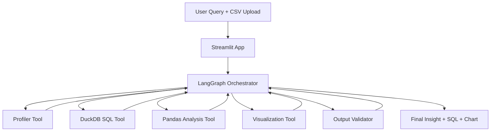

# AI Data Analyst Agent

An agentic AI data analyst that uses local LLMs, LangGraph, Pandas, and DuckDB to analyze datasets, generate insights, and visualizations from natural language queries.

## Overview

### What problem does it solve?

Business and product teams often need quick answers from CSV data without writing SQL or Python. This project turns plain-language questions into actionable analysis by combining structured tools (Pandas, DuckDB, charts) with an LLM-driven reasoning loop.

### Why agentic AI?

A single prompt-response model is often not enough for reliable analytics workflows. Agentic orchestration helps by:

- Planning multi-step analysis before answering
- Calling the right tool for the task (profiling, SQL, plotting)
- Iterating when outputs fail validation
- Producing responses that are more explainable and reproducible

## Architecture



## Features

- [x] CSV upload
- [x] Natural language analysis
- [x] Tool calling
- [x] SQL generation
- [x] Visualization

## Tech Stack

- Frontend: Streamlit
- Agent: LangGraph, LangChain, Ollama
- Data: Pandas, DuckDB
- Visualization: Plotly, Matplotlib
- Utilities: python-dotenv

## Example Questions

- "What are the top products?"
- "Why did revenue decline?"
- "Plot monthly sales"

## Evaluation

Accuracy is measured using benchmark questions and output validation:

- Question set coverage from `evaluation/test_questions.json`
- SQL and reasoning quality checks for correctness and relevance
- Response quality checks for completeness and clarity
- Optional manual review of generated visualizations and business conclusions

## Project Structure

```text
ai-data-analyst-agent/
├── README.md
├── requirements.txt
├── .gitignore
├── LICENSE
├── app.py
├── agent/
├── data/
├── analytics/
├── visualizations/
├── evaluation/
└── screenshots/
```

## Quickstart

1. Create and activate a Python environment.
2. Install dependencies:

   ```bash
   pip install -r requirements.txt
   ```

3. Run the Streamlit app:

   ```bash
   streamlit run app.py
   ```

## Notes

- The current codebase contains starter scaffolding for core modules.
- Replace placeholder logic with your preferred local LLM integration and tool behavior.
