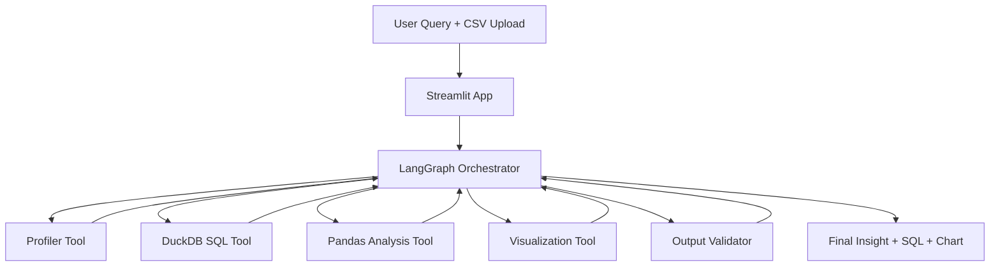

# AI Data Analyst Agent

An agentic AI data analyst for CSV-based business questions. It combines local LLM-assisted routing with grounded Pandas and DuckDB execution to turn natural language prompts into traceable answers, SQL, and visual summaries.

## Demo

[▶️ Watch the AI Data Analyst Agent Demo](https://www.youtube.com/watch?v=MzDM9F6JKdE)

## Overview

### What problem does it solve?

Business and product teams often need quick answers from CSV data without writing SQL or Python. This project is built for that exact use case: upload a dataset, ask a plain-language question, and get back a grounded answer with supporting evidence. The current version is strongest on descriptive, trend, diagnostic, and outlier-style questions over common business fields such as sales, profit, segment, region, discount, and date.

### Why agentic AI?

A single prompt-response model is often not enough for reliable analytics workflows. Agentic orchestration helps by:

- Planning multi-step analysis before answering
- Calling the right tool for the task (profiling, SQL, plotting)
- Iterating when outputs fail validation
- Producing responses that are more explainable and reproducible

## Architecture



## Features

- [x] CSV upload
- [x] Natural language analysis
- [x] Tool calling
- [x] SQL generation
- [x] Visualization

## Best Fit Use Cases

- Revenue and sales breakdowns by region, segment, or product
- Trend inspection across months or other time periods
- Quick diagnostic questions about declines, drops, or comparisons
- Outlier review for unusually low or high numeric values
- Lightweight analytics demos that need transparent SQL-backed answers

## Tech Stack

- Frontend: Streamlit
- Agent: LangGraph, LangChain, Ollama
- Data: Pandas, DuckDB
- Visualization: Plotly, Matplotlib
- Utilities: python-dotenv

## Example Questions

- "What are the top products?"
- "Why did revenue decline?"
- "Plot monthly sales"
- "What is total sales by region?"
- "How does average order value vary by segment?"
- "Are there unusually low-profit rows in the dataset?"

## Current Scope

- The app uses local LLM support mainly for query routing and concise summarization.
- Core computation is grounded in deterministic Pandas and DuckDB operations.
- It is not yet intended for forecasting, causal inference, or fully open-ended autonomous analysis.

## Evaluation

Accuracy is measured using benchmark questions and output validation:

- Question set coverage from `evaluation/test_questions.json`
- SQL and reasoning quality checks for correctness and relevance
- Response quality checks for completeness and clarity
- Optional manual review of generated visualizations and business conclusions

## Project Structure

```text
ai-data-analyst-agent/
├── README.md
├── requirements.txt
├── .gitignore
├── LICENSE
├── app.py
├── agent/
├── data/
├── analytics/
├── visualizations/
├── evaluation/
└── screenshots/
```

## Quickstart

1. Create and activate a Python environment.
2. Install dependencies:

   ```bash
   pip install -r requirements.txt
   ```

3. Run the Streamlit app:

   ```bash
   streamlit run app.py
   ```

## Docker Repro Setup

Use Docker Compose to run both the Streamlit app and Ollama so anyone can reproduce your environment.

1. Clone the repository and enter it:

   ```bash
   git clone <your-repo-url>
   cd ai-data-analyst-agent
   ```

2. Build and start containers:

   ```bash
   docker compose up -d --build
   ```

3. Pull the model used by the app inside the Ollama container:

   ```bash
   docker exec -it ai-data-analyst-ollama ollama pull qwen2.5-coder:3b
   ```

4. Open the app:

   - Streamlit UI: http://localhost:8501
   - Ollama API: http://localhost:11434

5. Verify both services are running:

   ```bash
   docker compose ps
   docker logs ai-data-analyst-app --tail=50
   docker logs ai-data-analyst-ollama --tail=50
   ```

6. Stop everything when done:

   ```bash
   docker compose down
   ```

7. Remove persisted Ollama model data (optional reset):

   ```bash
   docker compose down -v
   ```

### Repro Notes

- The app container is built from `Dockerfile` and exposes port `8501`.
- The Ollama container is defined in `docker-compose.yml` and persists models via the `ollama_data` volume.
- If you change `OLLAMA_MODEL` in `docker-compose.yml`, pull that same model in step 3.
- First model pull can take a while depending on network speed.

## Notes

- The current codebase contains starter scaffolding for core modules.
- Replace placeholder logic with your preferred local LLM integration and tool behavior.
